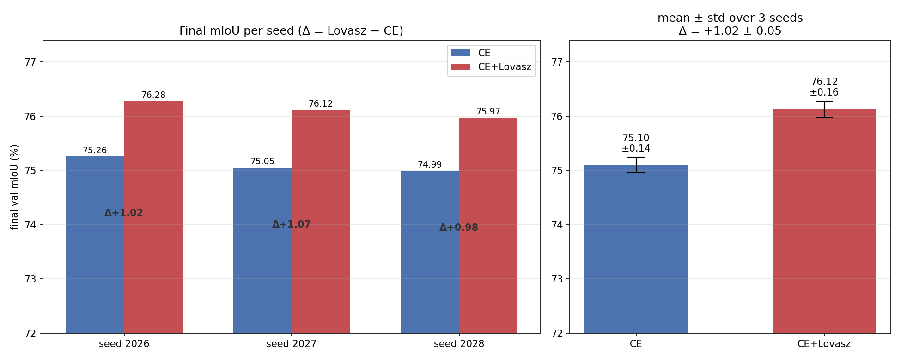
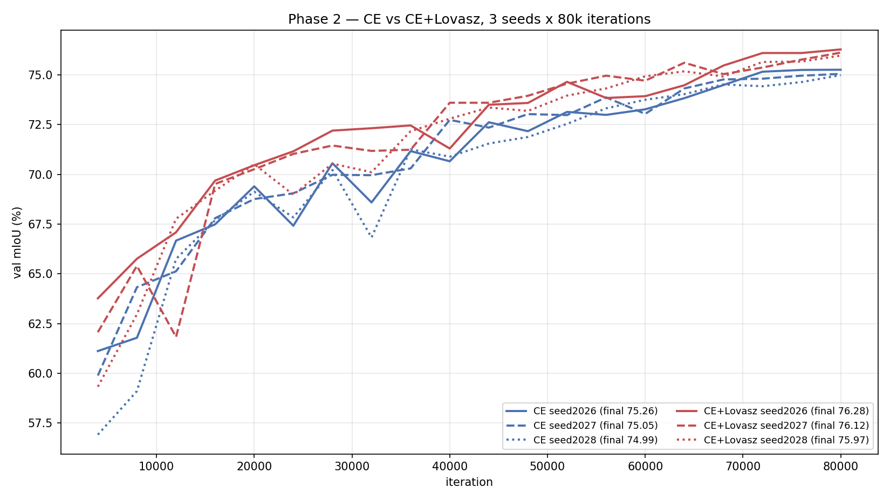
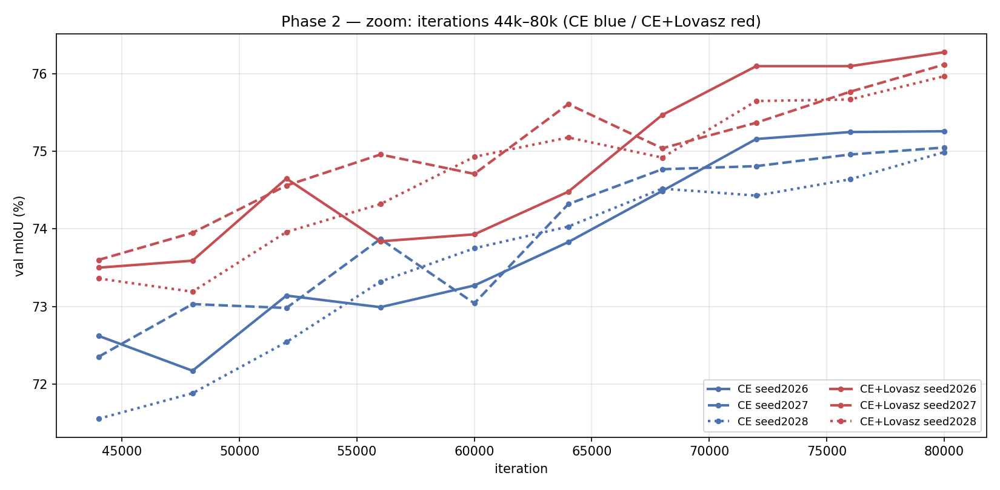
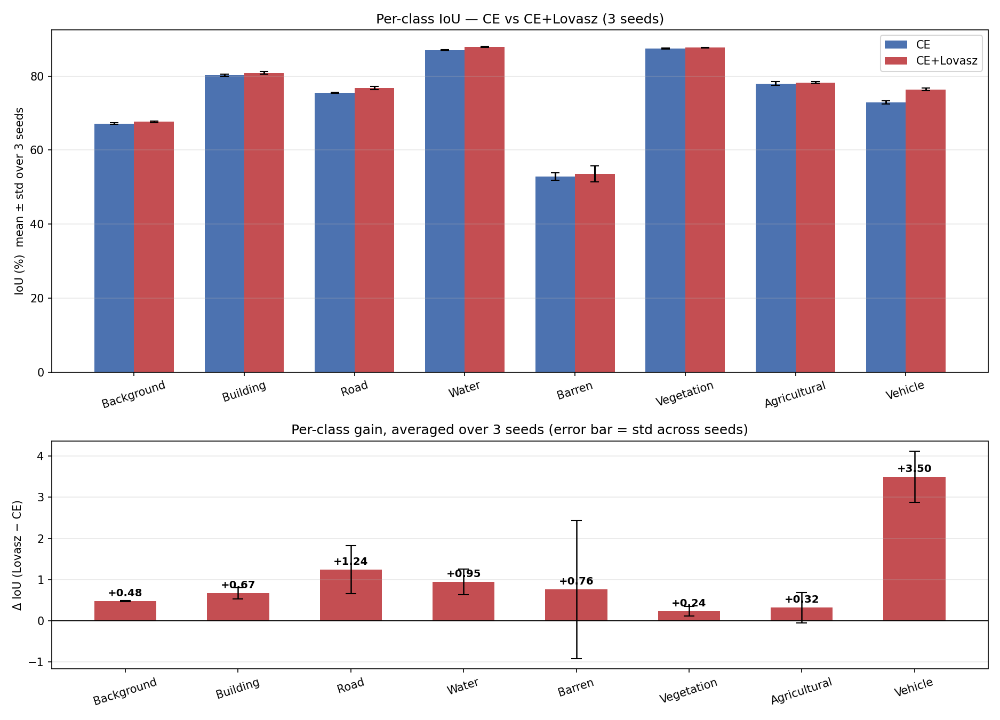
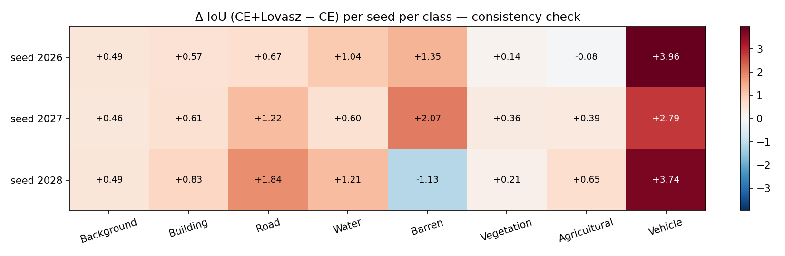
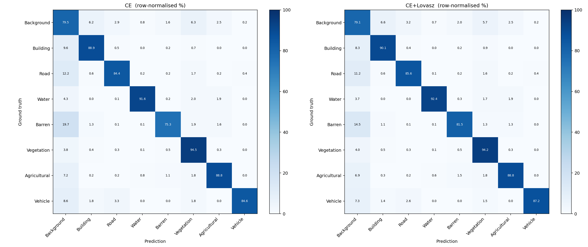
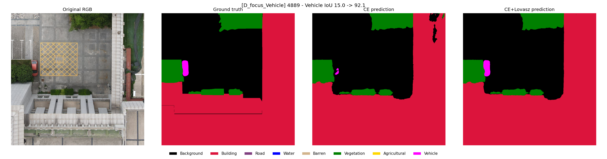

# AIC2026 UAV Segmentation — Phase 2

**CE vs CE+Lovasz: multi-seed stability check + error analysis**

Phase 1 ([phase1_loss_ablation.md](phase1_loss_ablation.md)) ranked CE+Lovasz first on a
single seed. Phase 2 asks two questions:

1. Does the +1.0 mIoU gain reproduce across seeds, or was it seed luck?
2. Where does the gain actually come from?

## 1. Setup

| | |
|---|---|
| Model | SegFormer-B0, pretrained MiT-B0 |
| Framework | MMSegmentation 1.2.2 / MMCV 2.1.0 / MMEngine 0.10.4 / PyTorch 2.1.0+cu121 |
| Hardware | 5 × RTX 4090, one experiment per GPU |
| Train / val | 5930 / 1066 (fixed split) |
| Protocol | crop 768², batch 2, AdamW, LinearLR 0–1500 + PolyLR 1500–80000, 80k iter, val every 4000, AMP |
| Seeds | 2026 (from Phase 1), 2027, 2028 |
| Varied | `randomness.seed` and `work_dir` **only** |

Loss config, split, crop, batch size, optimizer, lr, scheduler, augmentation, `max_iters`
and `val_interval` are identical to Phase 1. No tracked source or config was modified.

## 2. Multi-seed results

| | seed 2026 | seed 2027 | seed 2028 | mean | std |
|---|---:|---:|---:|---:|---:|
| **CE** | 75.26 | 75.05 | 74.99 | **75.10** | 0.14 |
| **CE+Lovasz** | 76.28 | 76.12 | 75.97 | **76.12** | 0.16 |
| **Δ (Lovasz − CE)** | **+1.02** | **+1.07** | **+0.98** | **+1.02** | **0.05** |

std = sample standard deviation (ddof=1, n=3).

**All 3 of 3 seeds: CE+Lovasz > CE.**



### 2.1 Why the paired delta is the load-bearing number

Two observations carry more weight than the means:

1. **The ranges do not overlap.** CE spans [74.99, 75.26], CE+Lovasz spans [75.97, 76.28].
   The worst Lovasz run beats the best CE run by 0.71 mIoU.
2. **The paired delta is ~3× tighter than the within-loss spread.** Per-loss std is
   0.14–0.16, but the std of the paired delta is only 0.05. Seed noise is largely
   common-mode: it moves both losses the same way and cancels in the difference. Hence the
   remarkably tight per-seed deltas (+1.02 / +1.07 / +0.98).

> **Statistical caveat.** n=3 on a single data split. Non-overlapping ranges plus a tight
> paired delta are strong *consistency* evidence, not a significance test — a paired t-test
> at n=3 is not meaningful, and one val split cannot exclude split-specific effects. The
> defensible claim is: **the ≈+1.0 mIoU gain reproduces reliably across seeds on this split.**

### 2.2 Convergence




All six runs peak at the final validation — no overfitting and no late-stage degradation,
so 80k is a sound budget. All six are still improving marginally at 80k, so the curves have
not fully plateaued.

## 3. Per-class IoU across seeds

| Class | CE (mean ± std) | CE+Lovasz (mean ± std) | Δ mean | Δ per seed (2026/2027/2028) | consistent? |
|---|---:|---:|---:|---|---|
| **Vehicle** | 72.88 ± 0.41 | **76.37 ± 0.39** | **+3.50** | +3.96 / +2.79 / +3.74 | yes, always ≫0 |
| **Road** | 75.50 ± 0.18 | **76.74 ± 0.41** | **+1.24** | +0.67 / +1.22 / +1.84 | yes |
| Water | 86.94 ± 0.14 | 87.89 ± 0.18 | +0.95 | +1.04 / +0.60 / +1.21 | yes |
| Barren | 52.81 ± 0.97 | 53.57 ± **2.16** | +0.76 | +1.35 / +2.07 / **−1.13** | **no — sign flips** |
| Building | 80.18 ± 0.27 | 80.85 ± 0.41 | +0.67 | +0.57 / +0.61 / +0.83 | yes |
| Background | 67.14 ± 0.18 | 67.62 ± 0.18 | +0.48 | +0.49 / +0.46 / +0.49 | yes, very stable |
| Agricultural | 77.95 ± 0.54 | 78.27 ± 0.17 | +0.32 | −0.08 / +0.39 / +0.65 | one slight negative |
| Vegetation | 87.42 ± 0.13 | 87.65 ± 0.13 | +0.24 | +0.14 / +0.36 / +0.21 | yes |




### 3.1 Where the +1.02 comes from

mIoU is the mean over 8 classes, so each class contributes `ΔIoU / 8`:

| Class | Δ IoU | contribution to Δ mIoU | share of total gain |
|---|---:|---:|---:|
| **Vehicle** | +3.50 | **+0.438** | **42.9 %** |
| Road | +1.24 | +0.155 | 15.2 % |
| Water | +0.95 | +0.119 | 11.6 % |
| Barren | +0.76 | +0.095 | 9.3 % |
| Building | +0.67 | +0.084 | 8.2 % |
| Background | +0.48 | +0.060 | 5.9 % |
| Agricultural | +0.32 | +0.040 | 3.9 % |
| Vegetation | +0.24 | +0.030 | 2.9 % |
| **total** | **+8.16** | **+1.020** | 100 % |

**The gain is concentrated: Vehicle alone is 42.9 %, Vehicle + Road is 58 %.** The other
six classes contribute +0.43 mIoU between them. This is a small-object / thin-structure
win, not a uniform improvement.

### 3.2 Correction to a Phase 1 conclusion

**The Barren gain does not reproduce.** In Phase 1 (seed 2026) Barren appeared to be the
second-largest beneficiary (+1.35). Across three seeds it is the only class whose sign
flips (−1.13 at seed 2028), and it carries by far the largest variance (Lovasz std 2.16,
~5× any other class). **Barren should be treated as noise, not as a Lovasz benefit.**

This is the second time Barren has produced a misleading single-run signal: in Phase 1 the
WCE configuration also appeared to lead the ablation at 2000 iterations purely because of
Barren, and that advantage disappeared by 80k. Per-class conclusions about Barren from a
single run are unsafe.

## 4. Error analysis (seed 2026, Phase 1 best checkpoints)

Checkpoints located automatically (highest `iter_*` among `best_mIoU*.pth`):
`formal80k_ce/best_mIoU_iter_80000.pth` and `formal80k_ce_lovasz/best_mIoU_iter_80000.pth`.
Full 1066-image val set, native 1024×1024, `mode='whole'`.

**Harness validation:** this independent inference reproduced mmseg's `IoUMetric` exactly
(CE 75.26, CE+Lovasz 76.28), so the confusion matrices and all derived quantities are
trustworthy.



### 4.1 Mechanism: recall, not precision

| | mean Precision | mean Recall | mean F1 |
|---|---:|---:|---:|
| CE | 85.10 | 85.96 | 85.47 |
| CE+Lovasz | 85.27 | 87.36 | 86.16 |
| Δ | **+0.17** | **+1.40** | +0.69 |

**Lovasz buys IoU with recall, not precision.** For Barren, Road and Building the pattern
is the same: precision drops slightly while recall rises substantially. Lovasz optimises a
direct IoU surrogate, so it accepts extra false positives to recover many more false
negatives — a net win on IoU.

**Vehicle is the exception, and that is why it wins biggest:** it is the only class where
precision *and* recall both improve (+2.64 / +2.57, with FP −217,705 and FN −207,971
simultaneously). That is a genuine quality gain rather than a trade-off.

### 4.2 Small-object recovery (Vehicle, per GT instance, 1654 instances)

An instance counts as recovered if ≥50 % of its GT pixels are predicted Vehicle.

| GT instance area (px) | n | CE | CE+Lovasz | Δ |
|---|---:|---:|---:|---:|
| 0–100 | 428 | 14.3 % | 14.0 % | −0.2 |
| **100–500** | 49 | 24.5 % | **36.7 %** | **+12.2** |
| **500–2000** | 212 | 70.3 % | **83.0 %** | **+12.7** |
| 2000–10000 | 753 | 91.6 % | 95.6 % | +4.0 |
| >10000 | 212 | 91.5 % | 92.0 % | +0.5 |

The Vehicle gain lives almost entirely in the **100–2000 px** band (+12 points).
**Instances below 100 px are a hard floor — both models recover only ~14 %.** Those 428
instances are a capability limit unrelated to the loss, most plausibly B0's output stride
and the 768 crop resolution.

Below, a representative case from the 100–2000 px band: CE recovers the car only as a
fragment (Vehicle IoU 15.0) while CE+Lovasz reconstructs the full shape (92.1).



### 4.3 Boundary vs interior

Boundary band = within 5 px of a GT label change.

| Model | boundary acc | interior acc | gap | boundary share of all errors |
|---|---:|---:|---:|---:|
| CE | 52.10 | 88.71 | 36.61 | 14.35 % |
| CE+Lovasz | 52.67 | 88.99 | 36.32 | 14.51 % |

Boundary accuracy is ~52 % against ~89 % in the interior — a **36-point gap** — but Lovasz
barely moves it (+0.57). **Lovasz does not win on boundary precision; it wins on
region-level recall.** Boundaries are only ~14.5 % of all errors, so ~85 % of the remaining
error is whole-region misclassification in the interior. That is the larger target.

### 4.4 Class confusion: Background is the sink

Top confusions as % of the GT class:

| GT | mistaken as | CE | CE+Lovasz |
|---|---|---:|---:|
| Barren | Background | 19.70 % | 14.54 % |
| Road | Background | 12.20 % | 11.18 % |
| Building | Background | 9.56 % | 8.32 % |
| Vehicle | Background | 8.60 % | 7.31 % |
| Agricultural | Background | 7.20 % | 6.90 % |

Every class bleeds primarily into **Background**, and Lovasz reduces that leakage across
the board — the recall gain of §4.1 seen from the confusion-matrix side. Barren is the
weakest class overall (IoU ~53, precision 65.5→63.2, FP:FN 2.57), suggesting its semantic
boundary against Background may be genuinely ambiguous in the labels.

### 4.5 Error-type summary

| Error type | Assessment |
|---|---|
| **False negative (miss)** | The dominant failure mode and Lovasz's main target. Lovasz cuts FN on Building (−2.3 M px), Road (−1.2 M), Barren (−1.3 M), Vehicle (−0.2 M). |
| **False positive** | Lovasz's cost. Barren FP:FN worsens 1.60→2.57, Building 1.01→1.20. Acceptable at IoU level, but Lovasz over-paints ambiguous regions. |
| **Boundary error** | Severe in absolute terms (52 % vs 89 %) but only 14.5 % of errors and essentially unchanged by loss choice. Needs architecture/resolution work. |
| **Class confusion** | Highly structured — nearly everything confuses with Background. Barren↔Background is the worst pair (14.5–19.7 %). |
| **Small-object miss** | Vehicle <100 px: ~86 % missed by both models. Hard resolution floor, loss-independent. Lovasz fixes the 100–2000 px band. |

## 5. Runtime and integrity

| Loss | seed | s/iter (>1500) | peak mem | wall clock | iters | non-finite loss |
|---|---|---:|---:|---:|---:|---:|
| CE | 2026 | 0.0934 | 1992 MB | 2.19 h | 80000 | 0 / 3200 |
| CE | 2027 | 0.0975 | 1991 MB | 2.29 h | 80000 | 0 / 3200 |
| CE | 2028 | 0.0971 | 1992 MB | 2.28 h | 80000 | 0 / 3200 |
| CE+Lovasz | 2026 | 0.0977 | 2200 MB | 2.29 h | 80000 | 0 / 4800 |
| CE+Lovasz | 2027 | 0.1005 | 2209 MB | 2.35 h | 80000 | 0 / 4800 |
| CE+Lovasz | 2028 | 0.0991 | 2208 MB | 2.33 h | 80000 | 0 / 4800 |

- All 24 000 logged loss values finite (verified programmatically).
- No NaN, Inf, OOM, traceback or AMP skipped steps in any of the six runs.
- Lovasz costs ~+3 % wall clock and ~+215 MB peak memory over CE.
- GPU utilisation stayed 31–37 % at batch 2 / 768² — the runs are not GPU-bound.

## 6. Conclusions

1. **CE+Lovasz beats CE reliably: +1.02 ± 0.05 mIoU, 3/3 seeds, non-overlapping ranges.**
   Adopt CE+Lovasz as the Phase 3 baseline.
2. **42.9 % of the gain is Vehicle**; Vehicle + Road is 58 %. A small-object /
   thin-structure win, not a uniform one.
3. **The mechanism is recall, not precision** (+1.40 vs +0.17): Lovasz recovers regions
   that CE leaks into Background.
4. **The Phase 1 Barren signal was noise** — it sign-flips across seeds with ~5× the
   variance of any other class.
5. **Two loss-independent ceilings identified:** boundary accuracy (52 % vs 89 % interior)
   and Vehicle instances below 100 px (~86 % missed by both). Neither is addressable by
   loss selection.

## 7. Recommended next steps

Not started — pending decision.

- **A. Stronger backbone.** SegFormer-B2 + CE+Lovasz, same split and protocol. The two
  ceilings in §6.5 are resolution/capacity-bound, which is what a larger backbone addresses.
- **B. Resolution for small objects.** Higher-resolution or sliding-window inference and/or
  a larger crop, targeting the 428 sub-100 px Vehicle instances.
- **C. Barren label audit.** Check whether Barren↔Background is a labelling ambiguity
  before any further Barren tuning.
- **D. Secondary validation split.** A source/scene-aware split to probe domain gap — every
  conclusion here rests on one split.
- Lower priority: Focal rescue (`alpha` 0.25→0.5), WCE class-weight recalibration, CE+Dice
  coefficient sweep.

## 8. Reproduction

```bash
export AIC2026_DATA_ROOT=<data>/train/train

# multi-seed runs (one GPU each); only seed and work_dir are overridden
CUDA_VISIBLE_DEVICES=0 python tools/train.py configs/aic2026/loss_ce.py \
  --cfg-options randomness.seed=2027 work_dir=<out>/phase2_seed_ce_2027
CUDA_VISIBLE_DEVICES=1 python tools/train.py configs/aic2026/loss_ce_lovasz.py \
  --cfg-options randomness.seed=2027 work_dir=<out>/phase2_seed_lovasz_2027
CUDA_VISIBLE_DEVICES=2 python tools/train.py configs/aic2026/loss_ce.py \
  --cfg-options randomness.seed=2028 work_dir=<out>/phase2_seed_ce_2028
CUDA_VISIBLE_DEVICES=3 python tools/train.py configs/aic2026/loss_ce_lovasz.py \
  --cfg-options randomness.seed=2028 work_dir=<out>/phase2_seed_lovasz_2028
```

Raw logs, confusion matrices, per-image metrics, the 16 qualitative quad-panels and the
analysis scripts are kept outside the repository (they contain absolute server paths and
large binaries) under `phase2_results/`, `phase2_error_analysis/` and `phase2_seeds/`.
