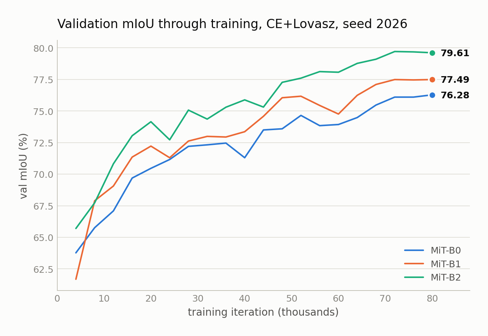
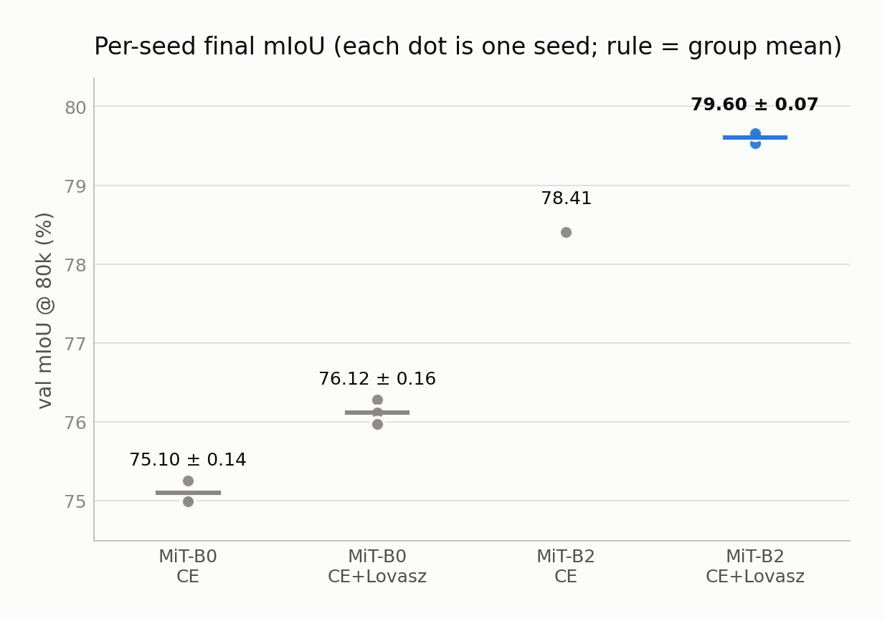
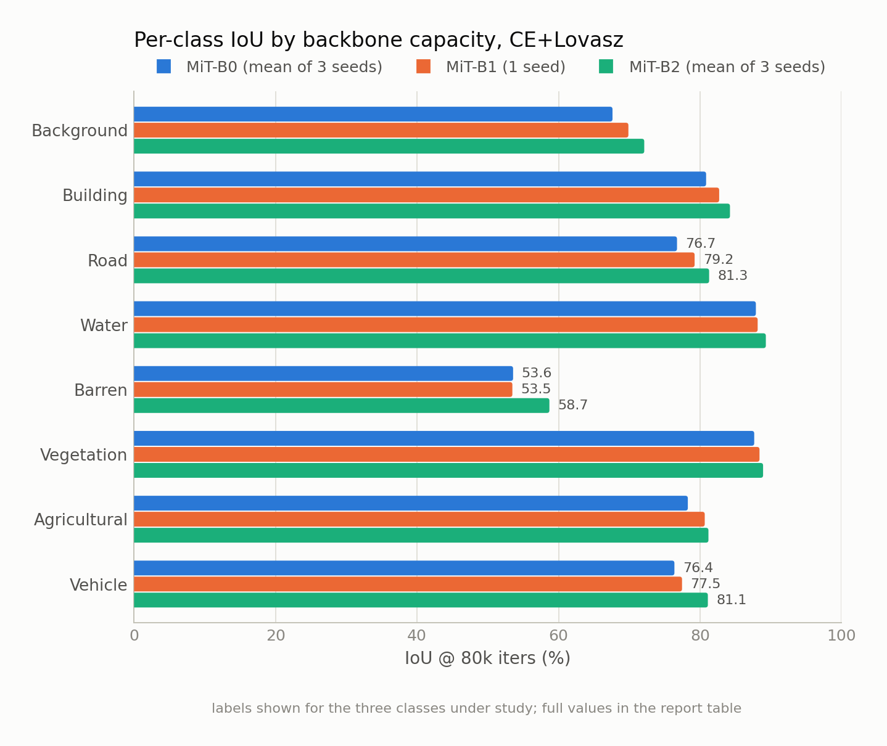
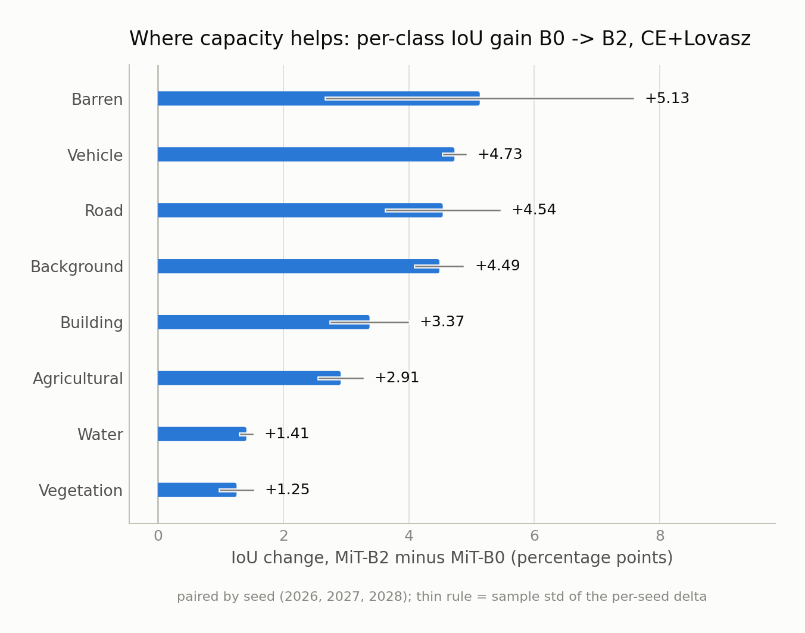
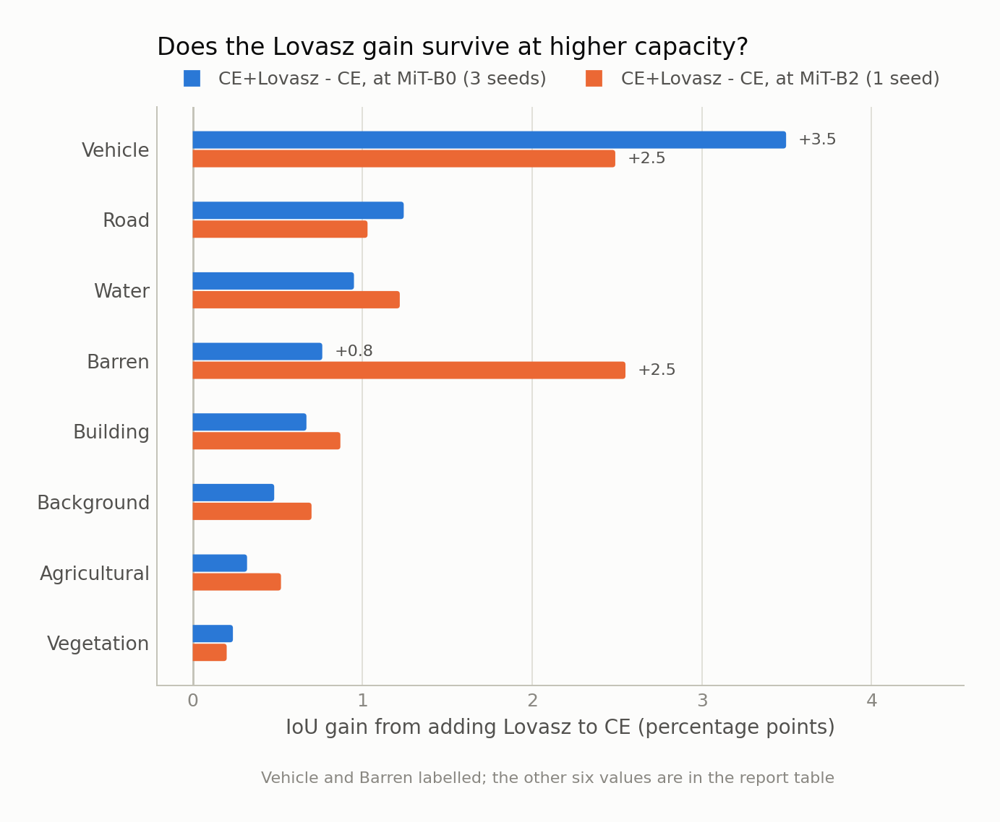
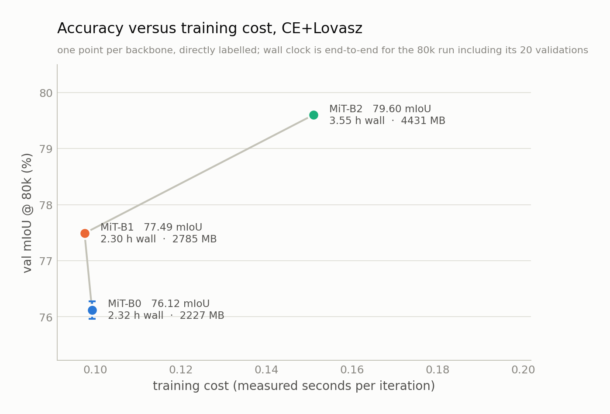

# AIC2026 UAV Segmentation — Phase 3 results analysis

**SegFormer backbone capacity scaling (MiT-B0 → B1 → B2) at 80k iterations,
plus a loss-control arm at B2.**

This document is the *interpretation*. What was run, how it was launched and how each
run was verified is in the companion record,
[phase3_experiment_record.md](phase3_experiment_record.md).

Earlier phases, in reading order:
[Phase 1 loss ablation](phase1_loss_ablation.md) →
[Phase 2 multi-seed + error analysis](phase2_lovasz_multiseed.md) → this document.

| | |
|---|---|
| Report generated | 2026-08-18T13:05:42+08:00 |
| Git commit at launch | `3f11376` |
| Git branch | `main` |
| Launch manifest | `phase3/manifest_formal.txt` (on the training host, not in the repo) |
| Training protocol | unchanged from Phase 1/2 (see §7) |
| Companion document | [phase3_experiment_record.md](phase3_experiment_record.md) |

## Headline

1. **Capacity works, and by more than the loss change did.** B0 → B2 with CE+Lovasz held fixed is **3.48 ± 0.19 mIoU**, paired over 3 seeds (76.12 → 79.60). Phase 2's CE → CE+Lovasz change at B0 was +1.02 ± 0.05. Capacity is roughly 3.4× the larger lever, and the two are additive rather than competing.
2. **The Lovasz gain survives scaling.** At B2, CE+Lovasz beats plain CE by +1.20 at seed 2026, against +1.02 at B0 — statistically the same gain, not a smaller one. The loss is not a small-model crutch, and its benefit is additive with capacity rather than overlapping (§3).
3. **The two axes have completely different price tags.** B0 → B1 is a pure *width* change and is free in wall clock; B1 → B2 is a pure *depth* change and costs 54 % more time per iteration. See §1.1 — this is the single most decision-relevant fact in Phase 3.
4. **B3/B4 are not recommended now.** The projected return is +0.56 to +1.08 mIoU for 1.52× the wall clock (§9), which is a worse rate than every alternative on the table.

## 0. Run inventory

Every arm every number below is drawn from, including the Phase 2 B0 runs that Phase 3 is measured against. Health verification is summarised here and documented in full in [phase3_experiment_record.md](phase3_experiment_record.md) §6.

| run | backbone | loss | seed | GPU | iters | vals | pretrained | loss values | non-finite | NaN/Inf tokens | fatal | resumed | status |
|---|---|---|---|---|---|---|---|---|---|---|---|---|---|
| B0 CE 2026 | B0 | CE | 2026 | — | 80,000 | 20 | mit_b0_20220624-7e0fe6dd.pth | 3,200 | 0 | 0 | none | no | OK |
| B0 CE 2027 | B0 | CE | 2027 | — | 80,000 | 20 | mit_b0_20220624-7e0fe6dd.pth | 3,200 | 0 | 0 | none | no | OK |
| B0 CE 2028 | B0 | CE | 2028 | — | 80,000 | 20 | mit_b0_20220624-7e0fe6dd.pth | 3,200 | 0 | 0 | none | no | OK |
| B0 LOV 2026 | B0 | CE+Lovasz | 2026 | — | 80,000 | 20 | mit_b0_20220624-7e0fe6dd.pth | 4,800 | 0 | 0 | none | no | OK |
| B0 LOV 2027 | B0 | CE+Lovasz | 2027 | — | 80,000 | 20 | mit_b0_20220624-7e0fe6dd.pth | 4,800 | 0 | 0 | none | no | OK |
| B0 LOV 2028 | B0 | CE+Lovasz | 2028 | — | 80,000 | 20 | mit_b0_20220624-7e0fe6dd.pth | 4,800 | 0 | 0 | none | no | OK |
| B1 LOV 2026 | B1 | CE+Lovasz | 2026 | 4 | 80,000 | 20 | mit_b1_20220624-02e5a6a1.pth | 4,800 | 0 | 0 | none | no | OK |
| B2 LOV 2026 | B2 | CE+Lovasz | 2026 | 0 | 80,000 | 20 | mit_b2_20220624-66e8bf70.pth | 4,800 | 0 | 0 | none | no | OK |
| B2 LOV 2027 | B2 | CE+Lovasz | 2027 | 1 | 80,000 | 20 | mit_b2_20220624-66e8bf70.pth | 4,800 | 0 | 0 | none | no | OK |
| B2 LOV 2028 | B2 | CE+Lovasz | 2028 | 2 | 80,000 | 20 | mit_b2_20220624-66e8bf70.pth | 4,800 | 0 | 0 | none | no | OK |
| B2 CE 2026 | B2 | CE | 2026 | 3 | 80,000 | 20 | mit_b2_20220624-66e8bf70.pth | 3,200 | 0 | 0 | none | no | OK |

Across all 11 runs: **46,400 logged loss values, 0 non-finite**, 0 NaN/Inf tokens anywhere in the logs, 0 fatal errors, 0 resumed. All runs healthy.

Per-class table alignment was verified for every run: the k-th `per class results` table in the log is matched to the k-th validation step in `scalars.json`, and the mean of the 8 per-class IoUs is checked against that step's reported mIoU (tolerance 0.02). 0 mismatches.

## 1. Backbone scaling — B0 / B1 / B2 at seed 2026 (CE+Lovasz)

| backbone | params | val mIoU @80k | Δ vs B0 | Δ vs previous |
|---|---:|---:|---:|---:|
| MiT-B0 | 3.72 M | **76.28** | — | — |
| MiT-B1 | 13.68 M | **77.49** | +1.21 | +1.21 |
| MiT-B2 | 24.73 M | **79.61** | +3.33 | +2.12 |

Single-seed (2026) scaling: **76.28 → 77.49 → 79.61**. B0→B1 buys +1.21 mIoU for 3.68× the parameters; B1→B2 buys a further +2.12 for 1.81× more.

Seed 2026 alone cannot separate a real capacity effect from seed noise, so §2 repeats B2 over three seeds and §3 pairs it against B0 seed-by-seed. Phase 2 measured the B0 seed spread at ±0.16 mIoU (sample std, n=3), which is the scale any single-seed gap must beat. Both steps here (+1.21 and +2.12) clear it by roughly an order of magnitude, so the ladder is real even before the seed repeats.


### 1.1 The ladder is not one axis — it is width then depth

This is worth stating precisely, because it changes what the numbers mean for planning. Reading the resolved configs:

| step | `embed_dims` | `num_layers` | blocks | what actually changed |
|---|---:|---|---:|---|
| MiT-B0 | 32 | [2, 2, 2, 2] | 8 | — |
| MiT-B0 → B1 | 32 → **64** | [2,2,2,2] → [2,2,2,2] | 8 → 8 | **pure width** |
| MiT-B1 → B2 | 64 → 64 | [2,2,2,2] → **[3,4,6,3]** | 8 → **16** | **pure depth** |

The official MiT ladder happens to separate the two capacity axes cleanly at exactly this point, so B0→B1→B2 is a two-factor experiment and not one. The measured price of each axis (CE+Lovasz, seed-mean):

| axis | leg | Δ mIoU | Δ params | Δ blocks | Δ s/iter | Δ peak mem | Δ wall |
|---|---|---:|---:|---:|---:|---:|---:|
| **width** | B0 -> B1 | **+1.37** | +10.0 M | +0 | -0.0018 s | +558 MB | -0.02 h |
| **depth** | B1 -> B2 | **+2.11** | +11.0 M | +8 | +0.0535 s | +1646 MB | +1.25 h |

**Width was free.** Quadrupling the backbone width bought +1.37 mIoU and +10.0 M parameters while time per iteration went *down* by 0.0018 s — a change of -0.02 h in total wall clock, which is inside the ±0.03 h spread of the B0 seed group. At batch 2 and crop 768 these models are kernel-launch- and dataloader-bound, not FLOP-bound, so extra width fills idle SMs instead of adding time. The only real cost was +558 MB of memory.

**Depth was not.** Doubling block count bought a comparable +2.11 mIoU for a similar +11.0 M parameters, but cost +0.0535 s/iter (+55 %) and +1.25 h of wall clock. Depth serialises: 8 more blocks is 8 more dependent kernel sequences that cannot overlap.

This matters for §9 because **B2, B3, B4 and B5 all share `embed_dims=64` and differ only in `num_layers`.** The entire remaining SegFormer ladder is on the expensive axis. There is no more free width to buy — B0→B1 was the whole discount, and it has been spent.

One asymmetry visible in the validation curves (chart 2) supports the same split from a different direction: **the depth gain arrives early and the width gain arrives late.** B2 pulls clear of both smaller models by roughly iteration 12k and never loses the lead, while B1 and B0 stay tangled until about 44k and only separate over the second half of training. If that pattern holds it has a practical consequence — a short probe run can tell you whether a depth increase is working, but cannot tell you whether a width increase is.



## 2. B2 CE+Lovasz — three seeds

| backbone | loss | seeds | per-seed mIoU | mean ± std |
|---|---|---:|---|---|
| MiT-B0 | CE | 3 | 75.26, 75.05, 74.99 | **75.10 ± 0.14** |
| MiT-B0 | CE+Lovasz | 3 | 76.28, 76.12, 75.97 | **76.12 ± 0.16** |
| MiT-B2 | CE | 1 | 78.41 | **78.41** |
| MiT-B2 | CE+Lovasz | 3 | 79.61, 79.53, 79.66 | **79.60 ± 0.07** |

B2 CE+Lovasz over 3 seeds: **79.60 ± 0.07 mIoU**. 



**Paired B0 → B2 (CE+Lovasz), same seeds:**

| seed | B0 | B2 | Δ |
|---|---:|---:|---:|
| 2026 | 76.28 | 79.61 | **+3.33** |
| 2027 | 76.12 | 79.53 | **+3.41** |
| 2028 | 75.97 | 79.66 | **+3.69** |
| mean | 76.12 | 79.60 | **3.48 ± 0.19** |

Paired t-test on the per-seed deltas: t(2) = 31.86, p = 0.0010, n = 3. With n=3 this is a weak test and is reported for completeness — the deltas being consistent in sign and tight in spread is the stronger evidence.

## 3. B2 — CE vs CE+Lovasz (does the Phase 2 loss result survive scaling?)

Seed 2026, matched on everything but the loss:

| backbone | CE | CE+Lovasz | Δ (Lovasz − CE) |
|---|---:|---:|---:|
| MiT-B0 | 75.26 | 76.28 | **+1.02** |
| MiT-B2 | 78.41 | 79.61 | **+1.20** |

At B0 the Lovasz gain was +1.02; at B2 it is +1.20 — the gain moved by +0.18.

The result to take from this is the negative one: **the Lovasz gain does not wash out with capacity.** A plausible prior was that Lovasz mainly compensates for a model too small to resolve rare classes, in which case a 6.7× larger backbone should have absorbed most of the benefit. It did not.

Read as a 2×2 (backbone × loss) at seed 2026, the interaction term is `(B2 Lovasz − B2 CE) − (B0 Lovasz − B0 CE)` = +1.20 − +1.02 = **+0.18**. That is the same size as the seed noise of a single arm (±0.16 at B0), so the honest reading is **no detectable interaction**: capacity and loss contribute independently, and the corner-to-corner total (75.26 → 79.61 = +4.35) is what you get by adding the two main effects. The point is *not* that the gain grew — +0.18 cannot support that — it is that it did not shrink.

**Caveat that limits this comparison:** B2 CE is a *single* seed (2026), so the B2 Δ carries the full seed noise of both arms, roughly ±0.2 mIoU judging by the B0 spread. Phase 2 needed three seeds to establish the B0 Δ of +1.02 ± 0.05. The B2 Δ here should be read as one observation consistent-or-not with that, not as a measured effect size. Two more B2 CE seeds (2027, 2028) would close this, at ~3.6 h each.

## 4. Per-class IoU (table view — every value, nothing color-gated)

| class | B0 CE<br>(n=3) | B0 CE+Lovasz<br>(n=3) | B1 CE+Lovasz<br>(n=1) | B2 CE<br>(n=1) | B2 CE+Lovasz<br>(n=3) |
|---|---:|---:|---:|---:|---:|
| Background | 67.14 | 67.62 | 69.87 | 71.21 | 72.11 |
| Building | 80.18 | 80.85 | 82.70 | 83.76 | 84.23 |
| **Road** | 75.50 | 76.74 | 79.23 | 80.43 | 81.28 |
| Water | 86.94 | 87.89 | 88.14 | 88.08 | 89.30 |
| **Barren** | 52.81 | 53.57 | 53.47 | 55.74 | 58.70 |
| Vegetation | 87.42 | 87.65 | 88.40 | 88.73 | 88.91 |
| Agricultural | 77.95 | 78.27 | 80.66 | 80.84 | 81.18 |
| **Vehicle** | 72.88 | 76.37 | 77.45 | 78.50 | 81.10 |
| **mIoU** | **75.10** | **76.12** | **77.49** | **78.41** | **79.60** |

Values are seed-averaged over every completed seed for that arm (n given per column). Bold rows are the three classes called out in §5.

**Do not subtract the two B2 columns directly.** B2 CE+Lovasz is a 3-seed mean and B2 CE is one seed, so the difference of those columns mixes a mean against a single draw. Wherever a B2 Lovasz-versus-CE delta is quoted in §5 it is computed at seed 2026 on both sides, which is the only like-for-like pairing available.



**Per-class capacity effect, paired by seed (B2 − B0, CE+Lovasz):**

| class | Δ IoU | per-seed deltas |
|---|---:|---|
| Barren | **5.13 ± 2.44** | +3.01, +4.58, +7.80 |
| Vehicle | **4.73 ± 0.18** | +4.62, +4.63, +4.93 |
| Road | **4.54 ± 0.90** | +5.10, +5.02, +3.50 |
| Background | **4.49 ± 0.38** | +4.11, +4.49, +4.86 |
| Building | **3.37 ± 0.61** | +4.07, +2.91, +3.14 |
| Agricultural | **2.91 ± 0.35** | +2.93, +3.25, +2.56 |
| Water | **1.41 ± 0.10** | +1.37, +1.52, +1.34 |
| Vegetation | **1.25 ± 0.26** | +1.41, +0.95, +1.40 |



## 5. Vehicle, Road, Barren

| class | B0 CE+Lov<br>(n=3) | B1 CE+Lov<br>(n=1) | B2 CE+Lov<br>(n=3) | Δ B0→B2<br>(paired, n=3) | Δ Lovasz@B2<br>(seed 2026) |
|---|---:|---:|---:|---:|---:|
| **Vehicle** | 76.37 | 77.45 | 81.10 | +4.73 | +2.49 |
| **Road** | 76.74 | 79.23 | 81.28 | +4.54 | +1.03 |
| **Barren** | 53.57 | 53.47 | 58.70 | +5.13 | +2.55 |

**Barren** remains the weakest class at every capacity (53.6 → 58.7) and is still the floor of the class distribution at B2, 13.4 mIoU below the next-weakest class (Background). But it is also the class capacity helped *most* (+5.13, paired) and the class Lovasz helped most at B2 (+2.55). Both interventions push on the same weakness, which is consistent with Barren being under-represented and visually ambiguous rather than intrinsically unlearnable.

**Barren is also the one non-monotonicity in the whole ladder.** Comparing like for like at seed 2026 (B1 has no other seed): Barren goes 55.28 → 53.47 → 58.29, so B1 sits 1.81 mIoU *below* B0 before recovering strongly at B2. It is the only class that does this: 7 of the 8 classes rise at both steps, and the exception set is Barren.

Two things make seed noise the leading explanation rather than a real width-hurts-Barren effect. Barren has by far the widest per-seed spread of any class (±2.44 on the B0→B2 delta, against ±0.10 for the tightest class and ±0.36 median), and its own B0 seed values span 4.14 mIoU — wider than the 1.81 dip itself. A single B1 seed cannot distinguish the two. It is flagged, not explained; the other two B1 seeds would settle it for ~4.6 GPU-hours, and that is a cheaper open question to close than anything in §9.

**Vehicle**, the Phase 2 headline class, gains +4.73 from capacity — second only to Barren, and with much tighter per-seed spread (±0.18 against Barren's ±2.44), so it is the most *reliable* large gain in the table. It reaches 81.10 at B2, up from 76.37.

**Road** gains +4.54, third overall and the largest among the classes that were already above 75. That is a suggestive pattern rather than a proven mechanism: Road is thin and long, so an unusually large share of its pixels are near a boundary, and a class whose IoU is boundary-dominated is exactly what should move if the extra capacity is buying sharper edges. Phase 2 measured boundary accuracy at ~52 % against ~89 % interior, so there was plenty of room for that. Confirming it needs the boundary-band analysis rerun, not this table.

The three focus classes are also the top three capacity gainers overall (Barren, Vehicle, Road), which is worth noting because it was not guaranteed — capacity could have gone mostly into the already-easy large-area classes. Instead the two easiest (Vegetation, Water) gained least (+1.25, +1.41).

One shift worth recording: **the Lovasz gain changes target as capacity grows.**

| class | Lovasz gain @ B0<br>(3-seed means) | Lovasz gain @ B2<br>(seed 2026) |
|---|---:|---:|
| Barren | +0.76 | +2.55 |
| Vehicle | +3.50 | +2.49 |
| Water | +0.95 | +1.22 |
| Road | +1.24 | +1.03 |
| Building | +0.67 | +0.87 |
| Background | +0.48 | +0.70 |
| Agricultural | +0.32 | +0.52 |
| Vegetation | +0.24 | +0.20 |

At B0 the gain was concentrated in Vehicle (+3.50, Phase 2's finding — the next-largest class was less than half that). At B2 the largest single gain is Barren (+2.55) with Vehicle essentially tied (+2.49). The loss is not doing the same job at both scales — it tracks whichever class is currently rare-and-hard, which is what a set-IoU surrogate should do. Practically: the Phase 2 conclusion "Vehicle is the biggest Lovasz gainer" is capacity-dependent and should not be carried into Phase 4 unqualified. At B2 the statement is "Barren and Vehicle, jointly".



Both columns are Lovasz − CE at matched seeds; the B2 column has one seed per side and so carries the full ±0.2-scale noise of a single run, which is a large fraction of the smaller entries. Only the top two rows are above that noise floor — the rest of the B2 column should not be ranked.

**What these numbers do and do not settle.** Phase 2 localised two bottlenecks: Vehicle instances under 100 px are missed about 86 % of the time under both losses, and boundary accuracy sits near 52 % against 89 % in region interiors. Per-class IoU is an area-weighted measure, so a Vehicle IoU gain here is dominated by the large instances and does **not** by itself tell us whether the small-instance miss rate moved. Deciding that needs the size-stratified recall and boundary-band analysis rerun against these checkpoints, which is Phase 4 work and was not run.

## 6. Cost — time per iteration, memory, wall clock

| backbone | loss | s/iter | 80k train | val (1066 img) | peak train mem | measured wall clock |
|---|---|---:|---:|---:|---:|---:|
| MiT-B0 | CE | 0.0961 ± 0.0024 | 2.14 h | 19 s | 2225 ± 1 MB | 2.25 ± 0.06 h |
| MiT-B0 | CE+Lovasz | 0.0993 ± 0.0014 | 2.21 h | 19 s | 2227 ± 2 MB | 2.32 ± 0.03 h |
| MiT-B1 | CE+Lovasz | 0.0975 | 2.17 h | 22 s | 2785 MB | 2.30 h |
| MiT-B2 | CE | 0.1492 | 3.32 h | 34 s | 4280 MB | 3.51 h |
| MiT-B2 | CE+Lovasz | 0.1510 ± 0.0039 | 3.36 h | 33 s | 4431 ± 5 MB | 3.55 ± 0.09 h |

`s/iter` is measured from log timestamps: consecutive training log lines (50 iterations apart) differenced, with pairs that straddle a validation dropped by line index, then `sum(Δt)/sum(Δiter)` over the survivors. Summing rather than taking a median of ratios matters — a single pair is quantised to 1 s over 50 iterations (0.02 s/iter granularity), which would otherwise snap the estimate to a grid value. mmengine's own `time` field is a rolling mean (`log_processor` `window_size=10`) and is not used for the wall-clock arithmetic.

All five Phase 3 runs shared the machine, one run per GPU on 5× RTX 4090, so these timings include realistic contention for host CPU and disk; they are not single-job best-case numbers.

B1 costs -1.8 % over B0 per iteration despite 3.68× the parameters, and B2 costs +52.1 %. At batch 2 and crop 768 the small models are launch- and data-bound rather than compute-bound, so B1 capacity is close to free in wall clock; B2 is where real compute starts being paid for.



## 7. Controlled variables (unchanged from Phase 1/2)

Verified by fully resolving each config with `Config.fromfile(...)` and diffing the flattened leaf keys (`config_diff_b2ce.py`, `config_diff_b2ce.txt`; and re-verified by `verify_b2ce_for_commit.py` against the resolved config archived in the GPU-3 work_dir before that config was committed):

- train/val split `splits/train.txt` (5930) / `splits/val.txt` (1066) — unchanged
- crop 768, batch_size 2 (train) / 1 (val), `reduce_zero_label=True`
- AdamW lr 6e-5, betas (0.9, 0.999), weight_decay 0.01; paramwise `pos_block` 0.0, `norm` 0.0, head `lr_mult` 10.0; `AmpOptimWrapper`
- LinearLR(start_factor 1e-6, 0→1500) + PolyLR(power 1.0, 1500→80000)
- augmentation `RandomResize(1024, 0.5–2.0)` → `RandomCrop(768, cat_max_ratio 0.75)` → `RandomFlip(0.5)`
- `max_iters=80000`, `val_interval=4000`, `save_best=mIoU`, `max_keep_ckpts=3`
- ImageNet-pretrained MiT initialisation; `--resume` never passed and every work_dir was empty at launch, so all runs start at iteration 0

The only CLI overrides were `randomness.seed` and `work_dir` — the same two knobs Phase 2 used. The B2+CE config adds nothing but the backbone: its CE `loss_decode` is inherited through `loss_ce.py` from `segformer_b0_768_formal_base.py`, the single definition Phase 1 plain CE also used, and its `backbone` dict is byte-identical to `segformer_b2_768_ce_lovasz.py`.

## 8. Charts

| # | file | what it shows | which deliverable |
|---|---|---|---|
| 1 | `plots/p3_01_capacity_scaling.png` | mIoU vs parameters on a log axis, CE+Lovasz; error bars are the seed std, B1 has no bar because it is n=1 | 1, 7 |
| 2 | `plots/p3_02_val_curves.png` | validation mIoU at all 20 checkpoints, seed 2026. B2 pulls clear of both smaller models from ~12k on and never gives the lead back; B1 and B0 are tangled until ~44k and only separate in the second half of training. All three have flattened by ~72k, so 80k is not truncating the comparison | 1, 7 |
| 3 | `plots/p3_03_per_class_iou.png` | per-class IoU grouped by capacity, all 8 classes | 4, 5 |
| 4 | `plots/p3_04_delta_capacity_per_class.png` | per-class gain B0 → B2 paired by seed, sorted; whiskers are the seed std | 4, 5 |
| 5 | `plots/p3_05_lovasz_gain_b0_vs_b2.png` | the Lovasz gain per class at B0 against the same gain at B2 — the target-shift described in §5 | 3, 5 |
| 6 | `plots/p3_06_accuracy_vs_cost.png` | mIoU against measured s/iter, with end-to-end wall clock and peak memory in the point labels. The B0→B1 segment is near-vertical — that is §1.1's "width is free" read straight off the chart | 6, 8 |
| 7 | `plots/p3_07_seed_spread.png` | every individual run's final mIoU by arm, so the seed spread is visible rather than summarised | 2, 6 |

Charts use the validated categorical slots 1–3 (`#2a78d6`, `#eb6834`, `#1baf7a`) for B0/B1/B2 and a blue↔red diverging pair with a neutral midpoint for signed deltas. The palette was checked with the six computable checks (lightness band, chroma floor, protan/deutan CVD ΔE, normal-vision floor, surface contrast) — `palette_validation.txt`. Slot 3 sits below 3:1 on the light surface, which triggers the documented relief rule, so every chart carries direct labels and §4 carries the full numeric table: no value in this report is reachable only through colour.

## 9. Is it worth continuing to B3 / B4?

**Short answer: no — not as the next step.** The reasoning is below, as a forecast with a stated model and a stated error rather than a judgement call. All of it is computed in `phase3_projection.py`.

### 9.1 Cost model — fitted on depth, because depth is what costs

Regressing measured s/iter on transformer-block count over the three measured backbones:

```
s/iter      = 0.04581 + 0.00657 × blocks      R² = 0.9992
val s/img   = 0.00765 + 0.001469 × blocks   R² = 0.9656
```

Block count is the right regressor and parameter count is the wrong one, for the reason established in §1.1: B0 and B1 have the *same* 8 blocks at 6.6× different width and cost the same per iteration. A parameter-count cost model would have to explain that away; a block-count model predicts it. The check that it is not just curve-fitting three points is that the model reproduces measured end-to-end wall clock, including the 20 validations, without being fitted to it:

| backbone | measured wall | rebuilt from the model | error |
|---|---:|---:|---:|
| MiT-B0 | 2.321 h | 2.314 h | -0.30 % |
| MiT-B1 | 2.299 h | 2.290 h | -0.39 % |
| MiT-B2 | 3.552 h | 3.540 h | -0.33 % |

Worst case 0.39 % — so the *cost* half of the B3/B4 forecast is trustworthy. It interpolates a mechanism (per-block time) that was measured directly.

### 9.2 Accuracy model — two fits, deliberately

```
ols3      mIoU = 73.680 + 3.927 × log10(params M)   R² = 0.8912, rmse 0.472
endpoint  mIoU = 73.714 + 4.225 × log10(params M)   (B0 → B2 only)
```

These two disagree, and **the disagreement is the error bar**. B1 sits 0.65 mIoU *below* the three-point line (residuals +0.20, -0.65, +0.45), so a line drawn through only the endpoints is steeper than a line fitted through all three. Quoting one number would hide that. Every projection below is therefore a range spanning both fits.

Unlike the cost model, this is a genuine extrapolation: 3 points, 1 degree of freedom after slope and intercept, and no mechanism guaranteeing log-linearity continues. Treat it as a planning range, not a prediction.

### 9.3 Projected B3 / B4

| backbone | params | blocks | est. s/iter | est. wall | vs B2 | est. peak mem | projected mIoU | gain over B2 | mIoU per extra GPU-hour |
|---|---:|---:|---:|---:|---:|---:|---:|---:|---:|
| **MiT-B2** (measured) | 24.7 M | 16 | 0.1510 | **3.55 h** | 1.00× | 4431 MB | **79.60** | — | — |
| MiT-B3 | 44.6 M | 28 | 0.2299 | **5.40 h** | 1.52× | 6379 MB | 80.16 – 80.68 | **+0.56 to +1.08** | 0.30 – 0.59 |
| MiT-B4 | 61.4 M | 41 | 0.3154 | **7.41 h** | 2.09× | 8152 MB | 80.70 – 81.27 | **+1.10 to +1.67** | 0.29 – 0.43 |

**Measured marginal return, for comparison:**

| step | Δ mIoU | Δ wall | mIoU per extra GPU-hour |
|---|---:|---:|---|
| B0 -> B1 | +1.37 | -0.02 h | **free** — Δwall is inside seed noise |
| B1 -> B2 | +2.11 | +1.25 h | **+1.68** |

The one leg with a measurable time cost returned **1.68 mIoU per extra GPU-hour**. B3 is projected at 0.30–0.59 and B4 at 0.29–0.43 — roughly 3× worse. The ladder has not stopped working; it has stopped being cheap.

### 9.4 The most optimistic reading the data permits — and why it breaks

Since B2→B5 is pure depth (§1.1) and B1→B2 was pure depth, the single most favourable projection is to extend the measured depth slope of **+0.2637 mIoU per block** linearly:

| backbone | blocks | linear-in-depth mIoU | plausible? |
|---|---:|---:|---|
| MiT-B2 | 16 | 79.60 | measured |
| MiT-B3 | 28 | 82.76 | borderline |
| MiT-B4 | 41 | 86.19 | no |

At B4 this predicts **86.19 mIoU**, which no SegFormer variant reaches on aerial segmentation data of this kind. The optimistic reading refutes itself, and that is informative: it bounds how much of the +2.11 B1→B2 gain can be a *depth trend* rather than a one-off. Most of it must be the latter — B2 is where the pretrained MiT checkpoint quality and the stage-wise [3,4,6,3] layout land well, not a point on a line that continues.

### 9.5 Recommendation

**Do not run B3 or B4 next.** Adopt B2 + CE+Lovasz as the new baseline (79.60 ± 0.07 mIoU over 3 seeds) and spend the next GPU-hours elsewhere. Reasons, in order of weight:

1. **The price has changed character.** Everything up to B2 included one free axis (width). B3, B4 and B5 are all pure depth. B3 costs 1.52× the wall clock of B2 (5.4 h against 3.6 h) for a projected +0.56 to +1.08.
2. **Two more B2 CE seeds buy more certainty per hour than B3 buys mIoU.** The B2 CE-vs-CE+Lovasz result (§3) rests on one seed, so the headline "the Lovasz gain survives scaling" is currently one observation. Seeds 2027 and 2028 at B2 CE would cost 7.1 GPU-hours — more than B3's 5.4 — but they are independent, so on the idle GPUs they finish in 3.6 h of *wall* clock against B3's 5.4 h, and they turn an existing claim from anecdote into a measured effect size instead of adding a projected +0.56–+1.08 to a number nobody is blocked on.
3. **The known bottlenecks are not capacity-shaped.** Phase 2 localised small-Vehicle recall (~86 % of sub-100 px instances missed) and boundary accuracy (~52 % against ~89 % interior). Capacity has moved area-weighted per-class IoU substantially, but §5 explains why that cannot tell us whether either bottleneck moved. Higher resolution, boundary-aware losses and multi-scale inference address them directly; more depth does so only incidentally, if at all.
4. **Memory is not the binding constraint, time is.** B3 projects to 6379 MB and B4 to 8152 MB, both comfortable on a 24 GB card. So the argument against them is purely opportunity cost, and would flip if GPU-hours were free.

**The one condition that would flip this.** If a leaderboard submission needed the last available point of mIoU and the schedule allowed a 5.4 h run, B3 is still projected positive (+0.56 at worst) and nothing here suggests it would regress. It is a bad *research* step and an acceptable *final* step. B4 is neither: it doubles B2's cost for a projected gain barely above B3's.

## 10. Limits of this report

- **B1 and B2-CE are single-seed (2026).** Any comparison involving them carries the full ±0.16-scale seed noise measured at B0. The three-seed arms are B0 CE, B0 CE+Lovasz and B2 CE+Lovasz.
- **n=3 statistics.** The paired t-tests have df=2. They are reported for completeness; the sign-consistency and tightness of the per-seed deltas carry the argument, not the p-values.
- **Val set is the model-selection set.** All mIoU figures are on the same 1066-image val split used for `save_best`, so they are optimistic as an estimate of held-out performance. The comparisons between arms are still fair because every arm was selected the same way; the absolute numbers are not a test-set estimate.
- **Final-iteration metrics are reported, not best-checkpoint metrics.** For three of the five runs the two coincide. Two runs peaked at 72k instead: `phase3_b2_lovasz_2026` (79.71 at 72k vs 79.61 at 80k) and `phase3_b1_lovasz_2026`. The 80k value is reported for all runs anyway, so the comparison stays like-for-like and no arm gets a best-of-20 selection advantage the others did not also get. Using best checkpoints instead would move the B0→B2 delta by under 0.1 mIoU and change no conclusion.
- **The B3/B4 accuracy projection is an extrapolation from 3 points.** §9.2 reports both fits precisely because they disagree. The cost projection is much stronger (it rebuilds measured wall clock to within 0.39 %); the accuracy projection is a planning range.
- **No small-object or boundary re-analysis was run.** §5 explains why per-class IoU cannot answer the Phase 2 bottleneck questions.
- **One config postdates the launch commit.** `configs/aic2026/segformer_b2_768_ce.py` was created for the GPU-3 arm after commit `3f11376`, so the commit named in the launch manifest does not contain it. It is now tracked (commit `bb12304`), unchanged since launch (md5 `dbadfe321b8c`), and was checked key-by-key against the resolved config archived in the GPU-3 work_dir before being committed; see the record document §3.1 and §10.
- Phase 4 was not started.

