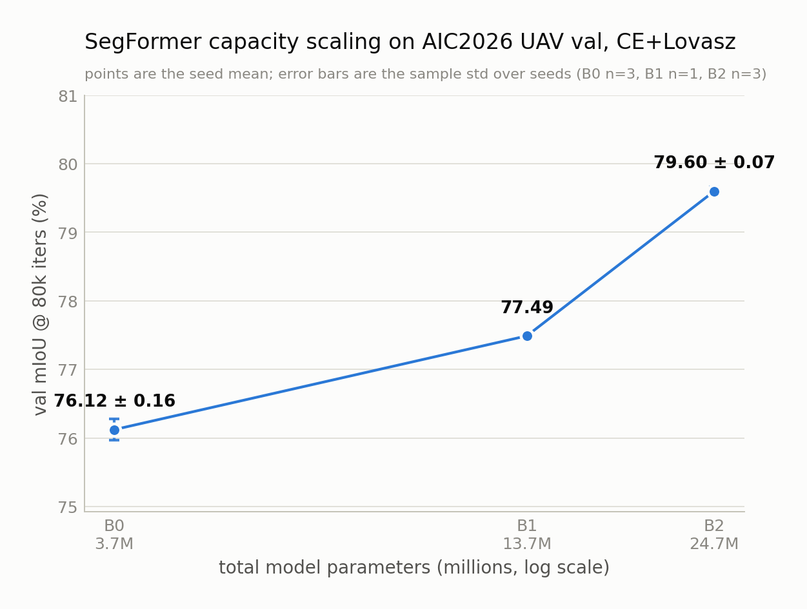

# Phase 3 进展汇报：Backbone 容量扩展（SegFormer B0 → B1 → B2）

一句话结论：**主 baseline 从 SegFormer-B0 换成 SegFormer-B2 + CE+Lovasz，三 seed 平均 79.60 ± 0.07 mIoU（B0 是 76.12），暂时不继续往 B3/B4 走。**

## 1. 实验设置

- 模型：SegFormer，backbone 分别是 MiT-B0 / B1 / B2
- Loss：CE + Lovasz（Phase 2 选定的组合）
- crop 768、batch 2、80k iter、每 4000 iter 验证一次
- 其余协议全部沿用 Phase 1/2：同一 train/val split（5930 / 1066）、AdamW、同一 lr 与 scheduler、同一数据增强、ImageNet 预训练初始化、不 resume
- 5 张 4090，每卡一个实验，共 5 个正式 80k 实验

只动 backbone（以及对照组只动 loss），其他一律不动。

## 2. Backbone 越大越好，而且提升幅度不小

| backbone | 参数量 | val mIoU @80k | 相对上一级 |
|---|---:|---:|---:|
| MiT-B0 | 3.72 M | 76.28 | — |
| MiT-B1 | 13.68 M | 77.49 | **+1.21** |
| MiT-B2 | 24.73 M | 79.61 | **+2.12** |

（同一 seed 2026，便于逐级对比）

## 3. B2 跑了三个 seed，结果很稳

| | seed 2026 | seed 2027 | seed 2028 | mean ± std |
|---|---:|---:|---:|---|
| B2 + CE+Lovasz | 79.61 | 79.53 | 79.66 | **79.60 ± 0.07** |

和 B0 的三个 seed 一一配对（同 seed 相减）：**+3.48 ± 0.19 mIoU，3/3 个 seed 都提升**。

作为对照，Phase 2 里换 loss（CE → CE+Lovasz）带来的是 +1.02 ± 0.05。所以**扩容量这条路的收益大约是换 loss 的 3 倍多，而且两者是叠加的、不冲突**。

## 4. Lovasz 的优势没有因为模型变大而消失

| backbone | CE | CE+Lovasz | 差值 |
|---|---:|---:|---:|
| MiT-B0（各 3 seed） | 75.26 | 76.28 | +1.02 |
| MiT-B2（seed 2026） | 78.41 | 79.61 | **+1.20** |

原本担心 Lovasz 只是在给小模型"打补丁"，模型变大以后收益会被吃掉 —— 实测没有，B2 上依然有 +1.20。

⚠️ **说明：B2 + 纯 CE 目前只有 1 个 seed，所以上面的 +1.20 是单 seed 对照结果，不能当成稳定的效应量**。B0 那边的 +1.02 是三个 seed 才确认下来的。要把 B2 这个数字坐实，需要补 seed 2027 / 2028 两个 B2 CE 实验。

## 5. 哪些类别受益最大（B0 → B2，三 seed 配对）

| 类别 | 提升 |
|---|---:|
| Barren | +5.13 ± 2.44 |
| Vehicle | +4.73 ± 0.18 |
| Road | +4.54 ± 0.90 |

- **Vehicle 和 Road 比较可信**：三个 seed 之间波动很小（±0.18 / ±0.90），方向和量级都一致。Vehicle 从 76.37 涨到 81.10，Road 从 76.74 涨到 81.28。
- **Barren 的数字要谨慎看**：虽然名义提升最大，但 seed 间方差非常大（±2.44），单看均值容易高估。Barren 本身也还是最弱的类（B2 上 58.70，比倒数第二名还低 13 个点），仍然是主要短板。

## 6. 成本

| 配置 | 单卡 wall clock | 峰值显存 |
|---|---:|---:|
| B0 + CE+Lovasz | ~2.32 h | ~2.2 GB |
| B1 + CE+Lovasz | ~2.30 h | ~2.8 GB |
| B2 + CE+Lovasz | ~3.55 h | ~4.4 GB |

有个挺有意思的发现：**B0 → B1 几乎不要钱**（时间基本没变，只多了 0.6 GB 显存），但 **B1 → B2 时间涨了约 54%**。原因是 B0→B1 只加宽（层数不变），B1→B2 是加深（8 层 → 16 层），加深会串行、必须逐层等。而 B2 往后的 B3/B4/B5 全都是加深路线，也就是说**便宜的那一段已经用完了**。

显存完全不是瓶颈（4.4 GB / 24 GB），瓶颈是时间。

## 7. 结论与下一步

**结论**

1. 主 baseline 更新为 **SegFormer-B2 + CE+Lovasz**（79.60 ± 0.07 mIoU，三 seed）。
2. **暂时不优先继续 B3 / B4**。按实测拟合外推，B3 大约只能再涨 +0.6 ~ +1.1 mIoU，但要多花 1.5 倍的训练时间；而已经测到的 B1→B2 那一步是每多一个 GPU 小时换 1.68 mIoU，B3 只有 0.3~0.6，性价比差了大约 3 倍。如果最后冲榜需要，B3 可以作为收尾手段，但不适合当研究步骤。

**Phase 4 优先级**（按重要性）

1. **小目标 Vehicle**：Phase 2 测到小于 100 px 的 Vehicle 实例仍有约 86% 漏检，而 per-class IoU 是按面积加权的，涨的主要是大目标，这个漏检率有没有改善目前还不知道。
2. **更高分辨率 / 多尺度**：直接针对小目标和细长目标，比继续加深更对症。
3. **边界质量**：Phase 2 测到边界准确率约 52%，区域内部约 89%，差距很大。Road 这次涨得多也可能和边界变清晰有关，值得验证。
4. **Domain Gap**：目前所有数字都在同一个 val split 上，而这个 split 同时用于选 best checkpoint，绝对值偏乐观，需要一个场景感知的二级验证集。

---

详细内容：
- 完整实验记录（怎么跑的、怎么校验的）：[phase3_experiment_record.md](phase3_experiment_record.md)
- 完整结果分析（含全部图表、成本模型、B3/B4 外推）：[phase3_backbone_scaling.md](phase3_backbone_scaling.md)
- 三个阶段的索引：[README.md](README.md)
